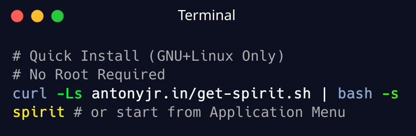

<p align="center">
    <br>
</p>


# Spirit [](https://github.com/antony-jr/spirit/issues) [](https://github.com/antony-jr/spirit/network) [](https://github.com/antony-jr/spirit/stargazers) [](https://github.com/antony-jr/spirit/blob/master/LICENSE) [](https://github.com/antony-jr/spirit/actions/workflows/deploy.yml)

<p align="center">
    <br>
</p>


Spirit is a modern and hackable desktop mascot, it operates very similar to **MaCoPix** and 
**Shimeji** but was never invented to replace either of them. Spirit is made just out of 
curiousity and as an alternative to both of them since both are legacy software.

Spirit is built from the ground up using Qt5 Framework and C++, uses rust for it's auxilary tools 
and helper applications. Spirit is also cross-platform and can run in all the major platforms 
with no issues.

[Ritual](https://github.com/antony-jr/ritual) is used to create new spirits, but you can download
official spirits from [here](https://antonyjr.in/spirit/docs/spirit-files/download).
You can also use [Spirit addons](https://antonyjr.in/spirit/docs/programs) which are simple 
programs which interacts with Spirit using it's REST API to do some meaningful things like 
notifying when a command fails.

**Wayland support is on the way but not anytime soon, sorry, please see why this is the case
in this small [blog post](https://antonyjr.in/spirit/blog/wayland)**.

# Quick Start (Only for GNU+Linux Users)

<p align="center">
    <br>
</p>

```
 curl -Ls antonyjr.in/get-spirit.sh | bash -s
 spirit # Start Spirit from Application Menu or Terminal

 # To Delta Update
 # Only Uses 10 MiB (maximum)
 curl -Ls antonyjr.in/update-spirit.sh | bash -s
```


# Installation

Download the software for your platform from [official website](https://antonyjr.in/spirit/). And
follow through the instructions. It's really simple, unlike **Shimeji** which involves installing
a legacy version of JRE.

For more information, please head over to the [official website](https://antonyjr.in/spirit/).

# Building

See the Github actions for each platform to get a idea on building this from source,
hard to explain since it's a bit hard. (Please use the prebuilt binaries)

**Dependencies:** Qt5 Framework, QArchive, CivetWeb

```
 $ git clone https://github.com/antony-jr/spirit 
 $ cd spirit
 $ cmake .
 $ make -j$(nproc)
```

# License

The GNU General Public License v3.

Copyright (C) 2021-present, D. Antony J.R
